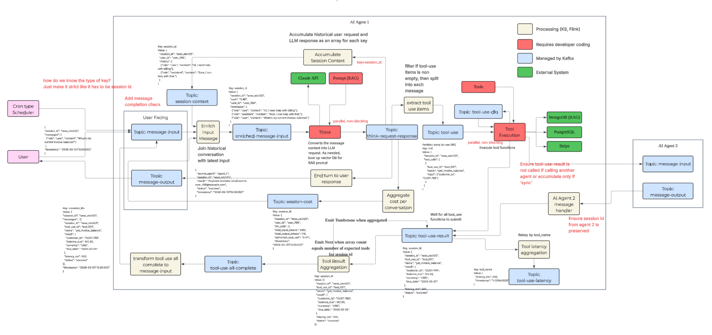

# FlightDeck

A reliable, AI Agent orchestration using Kafka.


## Getting Started

### Prerequisites

- [Docker](https://docs.docker.com/get-docker/) and [Docker Compose](https://docs.docker.com/compose/install/)
- An [Anthropic API key](https://console.anthropic.com/)

### Run

```bash
# 1. Clone the repo
git clone https://github.com/tsuz/ai-agent-orchestration-kafka-example.git
cd ai-agent-orchestration-kafka-example

# 2. Create your .env file
cp .env.example .env
# Edit .env and add your CLAUDE_API_KEY

# 3. Start all services
docker compose up --build
```

Once everything is up, open [http://localhost](http://localhost) in your browser.

### Services

| Service | Port |
|---------|------|
| Frontend (UI) | [localhost:80](http://localhost) |
| Chat API (REST) | [localhost:8000](http://localhost:8000) |
| Chat API (WebSocket) | localhost:8001 |
| Kafka | localhost:9092 |


## Project Structure

| Folder | Description |
|--------|-------------|
| `api/` | Chat API — REST endpoint and WebSocket server that accepts user messages and produces to Kafka |
| `processor-apps/` | Kafka Streams app — enriches messages with session history, aggregates tool results, and routes the pipeline |
| `think/` | Think consumer — calls the Claude API with tool definitions, produces LLM responses |
| `tools/` | Tool execution consumer — executes tool invocations (e.g. external APIs) dispatched by the LLM |
| `memoir/` | Memoir consumer — generates long-term session summaries using Claude |
| `monitoring/` | Logging consumer — tails all Kafka topics for observability |
| `frontend/` | React + TypeScript dashboard — chat UI, pipeline execution viewer, and logs |


### Configuration

All configuration is done via environment variables in the `.env` file. See [`.env.example`](.env.example) for defaults.

| Variable | Default | Description |
|----------|---------|-------------|
| `CLAUDE_API_KEY` | *(required)* | Your Anthropic API key |
| `CLAUDE_MODEL` | `claude-sonnet-4-20250514` | Claude model to use |
| `CLAUDE_MAX_TOKENS` | `8096` | Max tokens per Claude response |
| `MEMOIR_ENABLED` | `true` | Enable per-user long-term memory across sessions. Set to `false` to disable. |
| `MEMOIR_SESSION_INACTIVITY_THRESHOLD_SECONDS` | `20` | Seconds of inactivity before a session ends and memoir is saved. Only applies when `MEMOIR_ENABLED=true`. |
| `MEMOIR_SESSION_PUNCTUATE_INTERVAL_SECONDS` | `5` | How often (in seconds) to check for inactive sessions. Only applies when `MEMOIR_ENABLED=true`. |

### Tests

Requires Java 17+ and [Maven](https://maven.apache.org/install.html).

```bash
# Run all tests (processing stream app)
cd processor-apps/processing
mvn test
```

### Stop

```bash
docker compose down
```

## Architecture

 
