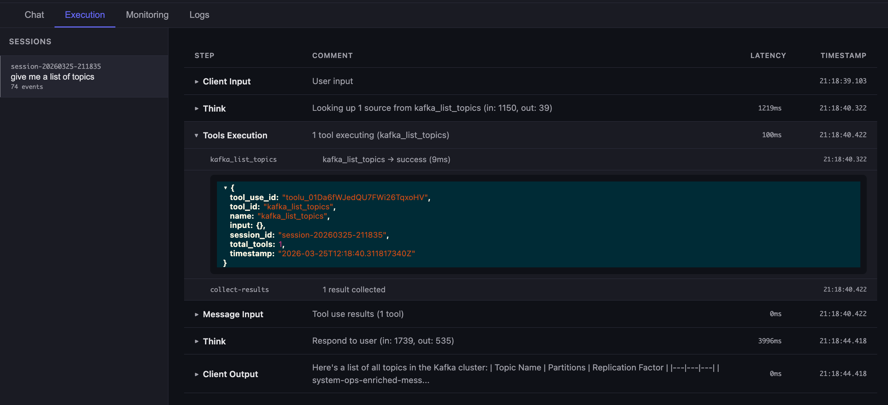

# FlightDeck

Fault tolerant, event driven, state managed AI Agent framework




## 📘 Docs

- [Documentation](https://tsuz.github.io/flightdeck-docs/)
- [Examples](https://github.com/tsuz/flightdeck/tree/main/examples)

## Getting Started

### Prerequisites

- [Docker](https://docs.docker.com/get-docker/) and [Docker Compose](https://docs.docker.com/compose/install/)
- An [Anthropic API key](https://console.anthropic.com/) or a [Google Gemini API key](https://aistudio.google.com/apikey)

### Run

```bash
# 1. Clone the repo
git clone https://github.com/tsuz/ai-agent-orchestration-kafka-example.git
cd ai-agent-orchestration-kafka-example/examples/lead-followup-agent

# 2. Add Claude API key to your .env file
cp .env.example .env
# Edit .env and add your CLAUDE_API_KEY

# 3. Start all services
docker compose up --build
```

Once everything is up, open [http://localhost](http://localhost) in your browser.


### Services

| Service | Port |
|---------|------|
| Frontend (UI) | [localhost:80](http://localhost) |
| Chat API (REST) | [localhost:8000](http://localhost:8000) |
| Chat API (WebSocket) | localhost:8001 |
| Kafka | localhost:9092 |


## Project Structure

| Folder | Description |
|--------|-------------|
| `api/` | Chat API — REST endpoint and WebSocket server that accepts user messages and produces to Kafka |
| `processor-apps/` | Kafka Streams app — enriches messages with session history, aggregates tool results, and routes the pipeline |
| `think/` | Think consumer — calls the LLM API (Claude or Gemini) with tool definitions, produces LLM responses |
| `tools/` | Tool execution consumer — executes tool invocations (e.g. external APIs) dispatched by the LLM |
| `memoir/` | Memoir consumer — generates long-term session summaries using Claude |
| `monitoring/` | Logging consumer — tails all Kafka topics for observability |
| `frontend/` | React + TypeScript dashboard — chat UI, pipeline execution viewer, and logs |


### Configuration

All configuration is done via environment variables in the `.env` file. See [`.env.example`](.env.example) for defaults.

| Variable | Default | Description |
|----------|---------|-------------|
| `AGENT_NAME` | *(required)* | Unique name for the AI agent instance. |
| `SYSTEM_PROMPT_FILE` | *(optional)* | Path to a text file containing the system prompt. If not set, a default generic prompt is used. If set but file not found, startup fails. |
| `TOOLS_JSON_FILE` | *(optional)* | Path to a JSON file defining the tools available to the agent. If not set, the agent runs without tools. If set but file not found, startup fails. See [`prompts/tools.json`](prompts/tools.json) for an example. |
| `LLM_PROVIDER` | `claude` | LLM provider to use — `claude` or `gemini` |
| `CLAUDE_API_KEY` | *(required for Claude)* | Your Anthropic API key |
| `CLAUDE_MODEL` | `claude-sonnet-4-20250514` | Claude model to use |
| `CLAUDE_MAX_TOKENS` | `8096` | Max tokens per Claude response |
| `GEMINI_API_KEY` | *(required for Gemini)* | Your Google Gemini API key |
| `GEMINI_MODEL` | `gemini-2.5-flash` | Gemini model to use |
| `GEMINI_MAX_TOKENS` | `4096` | Max tokens per Gemini response |
| `MEMOIR_ENABLED` | `true` | Enable per-user long-term memory across sessions. Set to `false` to disable. |
| `MEMOIR_SESSION_INACTIVITY_THRESHOLD_SECONDS` | `20` | Seconds of inactivity before a session ends and memoir is saved. Only applies when `MEMOIR_ENABLED=true`. |
| `MEMOIR_SESSION_PUNCTUATE_INTERVAL_SECONDS` | `5` | How often (in seconds) to check for inactive sessions. Only applies when `MEMOIR_ENABLED=true`. |
| `INPUT_TOKEN_PRICE` | *(optional)* | Price per 1M input tokens (e.g. `3` for $3/MTok). If not set, cost tracking is disabled. |
| `OUTPUT_TOKEN_PRICE` | *(optional)* | Price per 1M output tokens (e.g. `15` for $15/MTok). If not set, cost tracking is disabled. |
| `BUDGET_PRICE_PER_SESSION` | *(optional)* | Maximum dollar cost allowed per session. When the session cost goes over this limit, the agent stops processing on the next Think layer. Requires token prices to be set. |

### Tests

Requires Java 17+ and [Maven](https://maven.apache.org/install.html).

```bash
# Run all tests (processing stream app)
cd processor-apps/processing
mvn test
```

### Stop

```bash
docker compose down
```

## 🗾 Architecture

 


## ❤️ Support

If you like this project, please give it a ⭐️

<a href="https://github.com/tsuz/flightdeck/stargazers"></a>

## ⛔️ Warning

This library is not production ready. 
It is highly recommended to test very thoroughly if you're planning to release to a large group of users.


